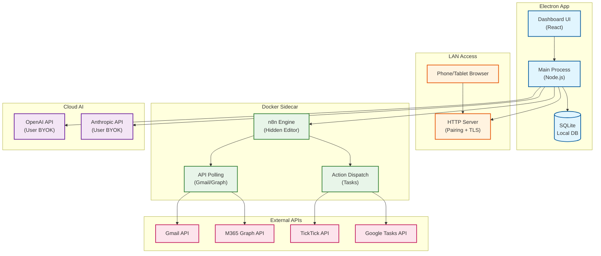

# Overview: AI-Powered Focus Board

**PDRs Referenced**: PDR-001, PDR-002, PDR-003, PDR-004, PDR-005

---

## 2. Overview

**Purpose**: High-level description of the product — what it is and why it exists

### 2.1 Product Description

An Electron desktop application that provides a unified dashboard for managing multiple email accounts (Gmail, M365) and task managers (TickTick, Google Tasks) with AI-powered triage. The app uses BYOK cloud LLMs for intelligent classification, runs n8n as a hidden automation engine, and delivers a self-hosted, MIT-licensed tool for multi-account consultants.

### 2.2 Purpose

Consultants and freelancers managing 3+ mixed-provider inboxes waste hours daily on email triage. Existing tools target single-account users or teams. This product solves the multi-account solo consultant problem by combining email unification, task consolidation, and AI-powered prioritization in one desktop app with native notifications.

### 2.3 Scope

**In Scope:**

- Electron desktop app with embedded SQLite
- BYOK cloud AI integration (OpenAI/Anthropic)
- n8n Docker sidecar for automation
- Gmail and M365 email connectors
- TickTick and Google Tasks integration
- Intelligent notification system
- LAN-accessible dashboard (pairing token + self-signed HTTPS)

**Out of Scope:**

- Web app / SaaS deployment
- Mobile native apps (iOS/Android)
- Local-only AI (Ollama) for v1
- Notion integration
- Todoist integration
- Corporate managed-device deployment

---

**PDR Traceability:**

| PDR | Category | Impact on Overview |
|-----|----------|-------------------|
| PDR-001 | Scope | Form factor and LAN access decisions |
| PDR-002 | Feature | AI execution posture |
| PDR-003 | NFR | Automation engine choice |
| PDR-004 | Business Model | License and commercial intent |

### 2.4 Feature Hierarchy

```mermaid
flowchart TD
    Dashboard["AI-Powered Unified Productity Dashboard"]
    
    Dashboard --> Email["Email Unification"]
    Dashboard --> Tasks["Task Consolidation"]
    Dashboard --> AI["AI Triage Engine"]
    Dashboard --> Notify["Intelligent Notifications"]
    Dashboard --> Infra["Infrastructure"]
    
    Email --> Gmail["Gmail Connector"]
    Email --> Graph["M365 Graph Connector"]
    Email --> Unified["Unified Inbox View"]
    
    Tasks --> TickTick["TickTick Integration"]
    Tasks --> GTasks["Google Tasks Integration"]
    Tasks --> Consolidated["Task Consolidation View"]
    
    AI --> Classify["Email Classification"]
    AI --> Priority["Priority Scoring"]
    AI --> Triage["Auto-Triage Rules"]
    AI --> BYOK["BYOK Provider Keys"]
    
    Notify --> Precision["Precision Filtering"]
    Notify --> Native["Native OS Notifications"]
    Notify --> LAN["LAN Dashboard Access"]
    
    Infra --> Electron["Electron Shell"]
    Infra --> SQLite["SQLite Storage"]
    Infra --> n8n["n8n Sidecar"]
    Infra --> Docker["Docker Runtime"]
```

### 2.5 Architecture Overview

**Architecture Notes:**

- Electron shell provides native notifications, filesystem access, and desktop integration
- n8n runs as a hidden Docker sidecar — users interact only through the app UI
- BYOK model: user supplies their own API keys; no central key management
- LAN access via HTTP server with pairing token + self-signed HTTPS
