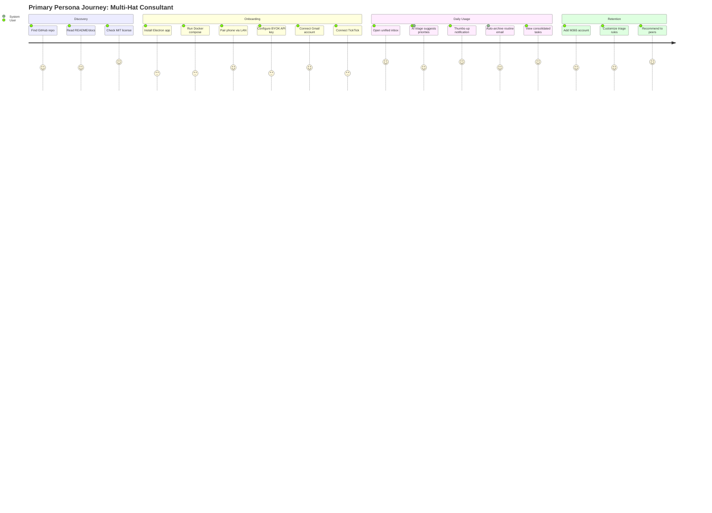

# Personas: AI-Powered Focus Board

**PDRs Referenced**: PDR-005

---

## 6. Personas

**Purpose**: Define target users and their needs

### 6.1 Primary Persona

**Name**: The Multi-Hat Consultant

| Attribute | Description |
|-----------|-------------|
| **Role** | Freelance consultant / contractor |
| **Experience** | Tech-savvy, comfortable with Docker and CLI |
| **Goals** | Manage 3+ client inboxes from one dashboard; triage email fast; consolidate tasks |
| **Pain Points** | Context switching between Gmail, Outlook, TickTick, Google Tasks; notification overload; trust concerns with cloud aggregators |
| **Needs** | Unified inbox, AI-powered prioritization, intelligent notifications, self-hosted control |
| **Success Quote** | "I want one place to see everything without being pinged for every email." |

**PDR Reference**: PDR-005

### 6.2 Secondary Persona

**Name**: The Privacy-Conscious Power User

| Attribute | Description |
|-----------|-------------|
| **Role** | Technical professional (developer, designer, writer) |
| **Experience** | Advanced; self-hosts services, uses BYOK tools |
| **Goals** | Keep email and tasks local; avoid vendor lock-in; customize triage rules |
| **Pain Points** | Cloud aggregators reading mail; subscription fatigue; inflexible triage |
| **Needs** | Full data control, BYOK AI, extensible rules, open-source transparency |
| **Success Quote** | "My email stays on my machine. Period." |

**PDR Reference**: PDR-002

### 6.3 Anti-Personas (Who This Is NOT For)

| Anti-Persona | Why Not Targeted |
|--------------|------------------|
| Corporate employee on managed device | Device policies block local mail readers; not the target |
| Single-account Gmail user | Superhuman/Mimestream already solve this well |
| Team collaboration lead | Missive/HelpScout target teams; solo consultant focus |
| Non-technical user | Docker prerequisite is a hard barrier |

---

**PDR Traceability:**

| PDR | Decision | Impact on Personas |
|-----|----------|-------------------|
| PDR-005 | Multi-hat consultant | Defines primary persona |
| PDR-002 | BYOK cloud-first | Defines secondary persona |
| PDR-003 | Docker prerequisite | Excludes non-technical users |

### 6.4 User Journey Visualization

