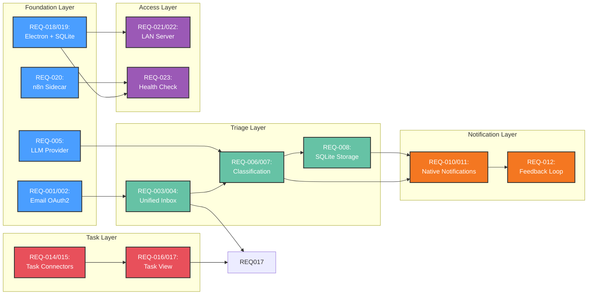
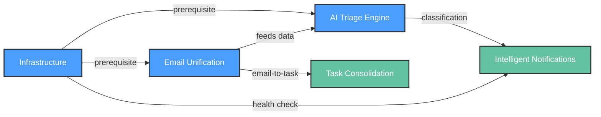

# Functional Requirements: AI-Powered Unified Productivity Dashboard

**PDRs Referenced**: PDR-001, PDR-002, PDR-003, PDR-005, PDR-007

---

## 7. Functional Requirements

**Purpose**: Define what the product must do

### 7.1 User Stories

| ID | Story | Persona | Priority | PDR |
|----|-------|---------|----------|-----|
| US-001 | As a consultant, I want to connect 3+ email accounts so I can see all messages in one dashboard | Multi-Hat Consultant | Must | PDR-005 |
| US-002 | As a consultant, I want AI to classify my emails so I know which ones need action | Multi-Hat Consultant | Must | PDR-002 |
| US-003 | As a consultant, I want notifications only for urgent emails so I am not distracted | Multi-Hat Consultant | Must | PDR-006 |
| US-004 | As a consultant, I want to consolidate tasks from TickTick and Google Tasks so I have one task view | Multi-Hat Consultant | Must | PDR-007 |
| US-005 | As a privacy-conscious user, I want to use my own API keys so no one reads my mail | Privacy-Conscious Power User | Must | PDR-002 |
| US-006 | As a consultant, I want to view my dashboard on my phone via LAN so I can check tasks on the go | Multi-Hat Consultant | Should | PDR-001 |
| US-007 | As a user, I want to set up the app in under 15 minutes so I can start triaging quickly | Multi-Hat Consultant | Must | PDR-006 |
| US-008 | As a user, I want the n8n engine hidden so I do not need to learn workflow tools | Multi-Hat Consultant | Must | PDR-003 |
| US-009 | As a user, I want triage rules to auto-archive routine emails so my inbox stays clean | Multi-Hat Consultant | Should | PDR-006 |
| US-010 | As a user, I want a thumbs-up/down on notifications so the AI learns my preferences | Multi-Hat Consultant | Could | PDR-006 |

### 7.2 Feature Requirements

#### Feature 1: Email Unification

**Description:** Connect multiple email accounts (Gmail, M365) and display all messages in a unified inbox view.

**Requirements:**

- **REQ-001:** Support Gmail API OAuth2 connection with no hard account cap
- **REQ-002:** Support Microsoft Graph API OAuth2 connection with no hard account cap
- **REQ-003:** Display all connected inboxes in a single unified view with account badges
- **REQ-004:** Preserve per-account identity (reply-from-account, account-specific folders)

**Acceptance Criteria:**

- [ ] User can connect 3+ Gmail accounts via OAuth2
- [ ] User can connect 1+ M365 accounts via OAuth2
- [ ] Unified inbox shows messages from all accounts with account indicator
- [ ] Reply/send uses the correct account identity

**Traced to:** PDR-005 (Persona), PDR-007 (Integration Phasing)

#### Feature 2: AI Triage Engine

**Description:** Classify incoming emails using BYOK cloud LLMs and apply priority scoring.

**Requirements:**

- **REQ-005:** Send full email payloads to user-configured LLM provider (OpenAI or Anthropic)
- **REQ-006:** Classify emails into priority levels (urgent, action, FYI, noise)
- **REQ-007:** Apply user-customizable triage rules based on classification
- **REQ-008:** Store classification results in SQLite for offline access
- **REQ-009:** Store BYOK API keys in OS keychain, not plain text

**Acceptance Criteria:**

- [ ] User can configure OpenAI or Anthropic API key
- [ ] Emails are classified within 5 seconds of arrival
- [ ] Classification accuracy 85% or higher after 2 weeks of user feedback
- [ ] API keys stored in OS keychain, never in plain text
- [ ] Full payload sent to cloud LLM with consent displayed at onboarding

**Traced to:** PDR-002 (AI Execution), PDR-006 (Metrics)

#### Feature 3: Intelligent Notifications

**Description:** Deliver native OS notifications only for emails classified as urgent, with precision filtering.

**Requirements:**

- **REQ-010:** Use Electron native notification API (no browser notifications)
- **REQ-011:** Filter notifications by AI classification, only urgent emails trigger pings
- **REQ-012:** Provide thumbs-up/down feedback on each notification to improve precision
- **REQ-013:** Support quiet hours and do-not-disturb modes

**Acceptance Criteria:**

- [ ] Only emails classified as urgent trigger native notifications
- [ ] User can provide thumbs-up/down on each notification
- [ ] Precision target: 90% or higher of notifications are genuinely actionable
- [ ] Quiet hours respected, no notifications during configured times

**Traced to:** PDR-006 (Metrics), PDR-001 (Form Factor)

#### Feature 4: Task Consolidation

**Description:** Consolidate tasks from TickTick and Google Tasks into a single task view.

**Requirements:**

- **REQ-014:** Connect TickTick via API and sync tasks bidirectionally
- **REQ-015:** Connect Google Tasks via API and sync tasks bidirectionally
- **REQ-016:** Display consolidated task list with source badges
- **REQ-017:** Allow task creation from email (one-click convert to task)

**Acceptance Criteria:**

- [ ] User can connect TickTick account
- [ ] User can connect Google Tasks account
- [ ] Tasks from both sources appear in unified view
- [ ] User can create a task from any email with one click

**Traced to:** PDR-007 (Integration Phasing), PDR-005 (Persona)

#### Feature 5: Infrastructure

**Description:** Electron desktop app with embedded SQLite, n8n Docker sidecar, and LAN-accessible dashboard.

**Requirements:**

- **REQ-018:** Electron shell with contextBridge and IPC handler security rules
- **REQ-019:** Embedded SQLite database for email metadata, triage results, and task cache
- **REQ-020:** n8n running as Docker sidecar, hidden from user (no editor UI exposed)
- **REQ-021:** HTTP server exposing dashboard to LAN devices with pairing token
- **REQ-022:** Self-signed HTTPS on LAN server for encrypted LAN traffic
- **REQ-023:** Docker health-check wizard for n8n sidecar status

**Acceptance Criteria:**

- [ ] App runs as Electron desktop application
- [ ] SQLite stores all data locally
- [ ] n8n sidecar starts with Docker compose and is not user-facing
- [ ] LAN dashboard accessible from phone/tablet browser
- [ ] Pairing token required for LAN access
- [ ] Self-signed HTTPS enabled on LAN server
- [ ] Health-check wizard shows n8n status in app

**Traced to:** PDR-001 (Form Factor), PDR-003 (Automation Engine)

### 7.3 Requirements Priority Matrix

| Priority | Count | Description |
|----------|-------|-------------|
| Must | 15 | Critical for launch |
| Should | 4 | Important but not blocking |
| Could | 1 | Nice to have |
| Won't | 0 | Explicitly excluded |

---

### 7.4 Requirement Dependencies

### 7.5 Feature Dependencies

---

**PDR Traceability:**

| PDR | Decision | Impact on Requirements |
|-----|----------|------------------------|
| PDR-001 | Electron + LAN | REQ-018 through REQ-023 |
| PDR-002 | BYOK cloud AI | REQ-005 through REQ-009 |
| PDR-003 | n8n sidecar | REQ-020, REQ-023 |
| PDR-005 | Consultant persona | US-001 through US-009 |
| PDR-006 | Success metrics | Defines acceptance criteria thresholds |
| PDR-007 | Gmail-first phasing | REQ-001, REQ-014 prioritized first |
