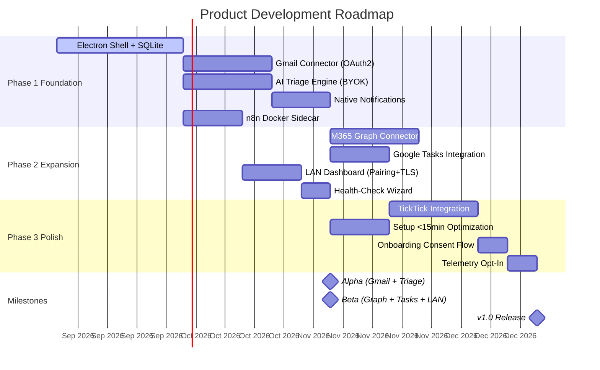

# Roadmap and Milestones: AI-Powered Focus Board

**PDRs Referenced**: PDR-007, PDR-006, PDR-005

---

## 11. Roadmap and Milestones

**Purpose**: Define product release milestones with feature groupings

### 11.1 Roadmap Overview

### 11.2 Milestone 1: Alpha (Gmail + AI Triage)

**Demo Sentence:** After this milestone, the user can: connect 2+ Gmail accounts, see AI-classified emails in a unified inbox, and receive native notifications only for urgent emails.

**Status:** Planned

**Release Goal:** Validate the core triage promise with the owner's own Gmail accounts.

| Feature | Priority | Demo Sentence | Dependencies |
|---------|----------|---------------|--------------|
| Electron shell + SQLite | Must | User can launch the app and see a dashboard | None |
| Gmail OAuth2 connector | Must | User can connect a Gmail account | Electron shell |
| BYOK API key setup | Must | User can configure OpenAI/Anthropic key | Electron shell |
| AI email classification | Must | Emails are classified as urgent/action/FYI/noise | Gmail + API key |
| Native notifications | Must | User receives notifications for urgent emails only | Classification |
| n8n Docker sidecar | Must | n8n runs hidden, orchestrates polling | Docker |

**Success Criteria:**

| Metric | Target | Measurement |
|--------|--------|-------------|
| Gmail connection success | 100% | OAuth flow completion |
| Classification accuracy | 85%+ | Thumbs-up rate |
| Notification precision | 90%+ | Thumbs-up/down ratio |

**PDR Reference:** PDR-007 (Gmail first)

---

### 11.3 Milestone 2: Beta (Graph + Tasks + LAN)

**Demo Sentence:** After this milestone, the user can: connect M365 accounts, consolidate tasks from Google Tasks, and view the dashboard from their phone via LAN.

**Status:** Planned

**Release Goal:** Prove multi-provider support and LAN access work end-to-end.

| Feature | Priority | Demo Sentence | Dependencies |
|---------|----------|---------------|--------------|
| M365 Graph connector | Must | User can connect an Outlook account | Electron shell |
| Google Tasks integration | Must | User can see Google Tasks in consolidated view | Electron shell |
| LAN dashboard | Must | User can view dashboard from phone browser | Electron shell |
| Pairing token + HTTPS | Must | LAN access requires pairing and is encrypted | LAN dashboard |

**Features Deferred from Previous:**

- None (Alpha features carry forward)

**Success Criteria:**

| Metric | Target | Measurement |
|--------|--------|-------------|
| M365 connection success | 100% | OAuth flow completion |
| Task consolidation | Both sources visible | Unified task view |
| LAN access from phone | Working | Manual test |

**PDR Reference:** PDR-007 (Graph second)

---

### 11.4 Milestone 3: v1.0 Release (TickTick + Polish)

**Demo Sentence:** After this milestone, the user can: connect TickTick, complete setup in under 15 minutes, and receive AI-powered triage across all connected accounts.

**Status:** Planned

**Release Goal:** Ship the complete v1.0 product with all connectors and polished onboarding.

| Feature | Priority | Demo Sentence | Dependencies |
|---------|----------|---------------|--------------|
| TickTick integration | Must | User can see TickTick tasks in consolidated view | Electron shell |
| Setup optimization | Must | User completes setup in under 15 minutes | All connectors |
| Onboarding consent | Must | User sees full payload policy before enabling AI | BYOK setup |
| Health-check wizard | Must | User can see n8n sidecar status in app | n8n sidecar |

**PDR Reference:** PDR-007 (TickTick fourth)

---

### 11.5 Milestones Traced to PDRs

| Milestone | PDR | Target Date | Status |
|-----------|-----|-------------|--------|
| Alpha (Gmail + Triage) | PDR-007 | TBD | Planned |
| Beta (Graph + Tasks + LAN) | PDR-007 | TBD | Planned |
| v1.0 Release | PDR-007, PDR-006 | TBD | Planned |

---

**PDR Traceability:**

| PDR | Decision | Impact on Roadmap |
|-----|----------|-------------------|
| PDR-007 | Gmail-first phasing | Milestone ordering and feature grouping |
| PDR-006 | Success metrics | Defines per-milestone success criteria |
| PDR-005 | Consultant persona | Drives the dogfooding-first approach |
