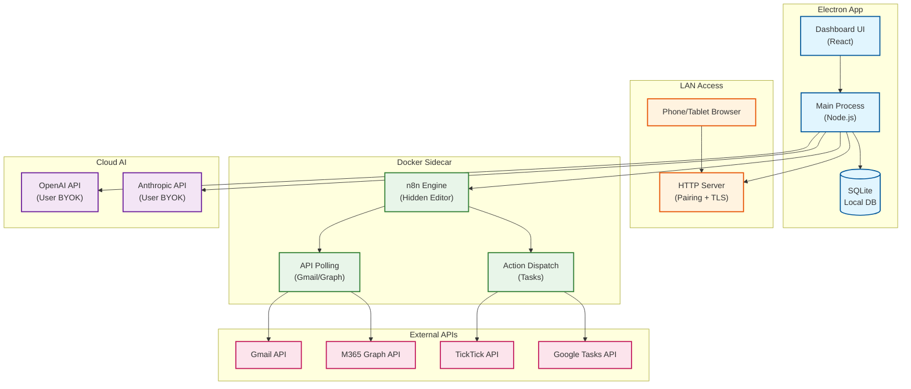
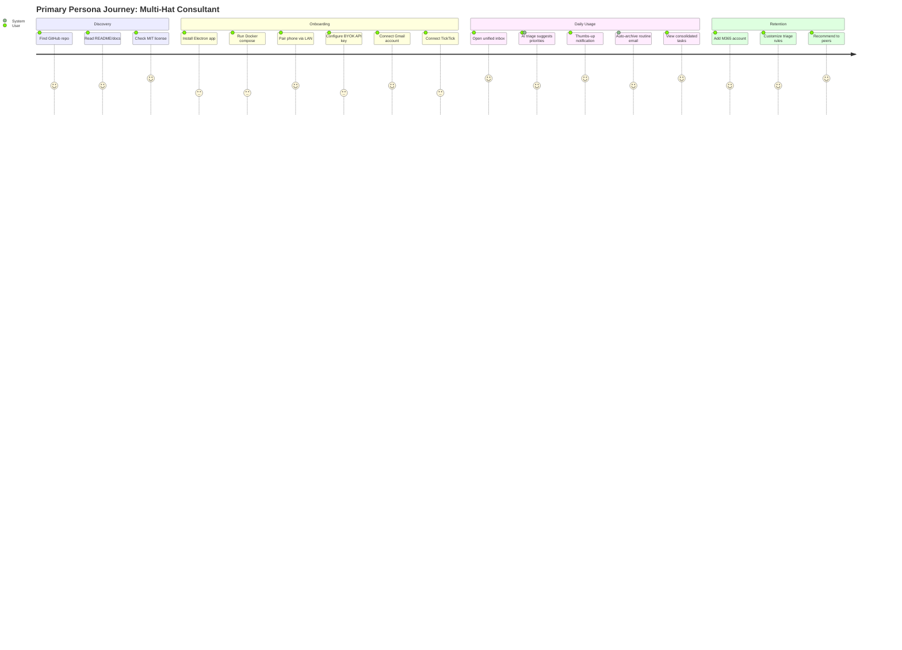
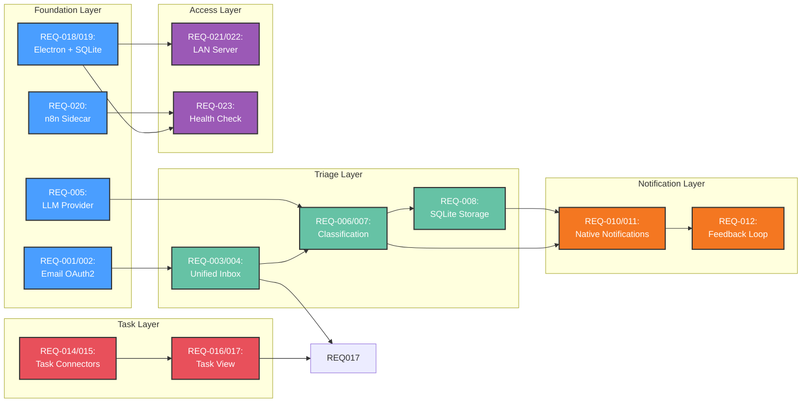
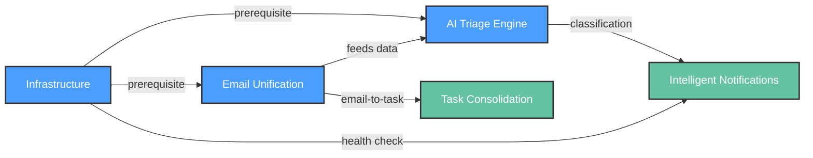
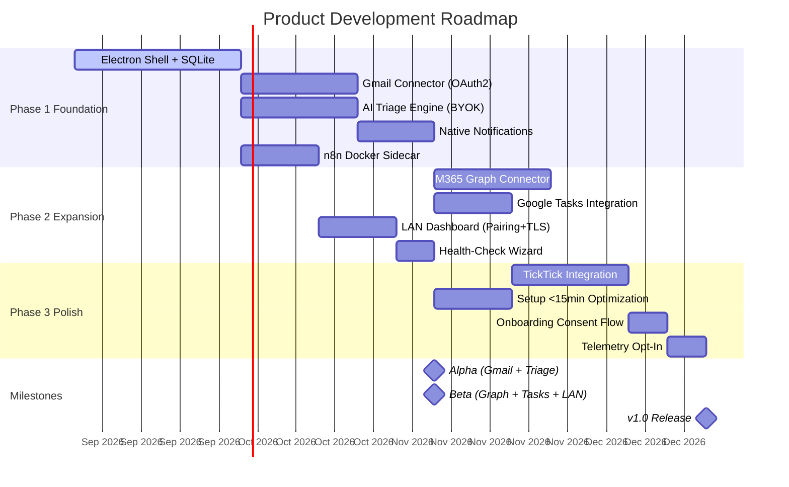

# Product Requirements Document: AI-Powered Unified Productivity Dashboard

---

# Document Information: AI-Powered Unified Productivity Dashboard

---

## 1. Document Information

**Title:** AI-Powered Unified Productivity Dashboard — Product Requirements Document

**Version:** 1.0

**Date:** 2026-08-23

**Author:** User/AI collaboration

**Status:** Draft

### Quick Stats

| Attribute | Value |
|-----------|-------|
| Product Type | Electron desktop app |
| Target User | Freelancers/consultants, 25-45, multi-account |
| Core Promise | One dashboard for email triage and task management |
| AI Approach | BYOK cloud-first (OpenAI/Anthropic) |
| Automation Engine | n8n (Docker sidecar) |
| License | MIT |
| Phase 1 Connectors | Gmail, Google Tasks, TickTick |

### Revision History

| Version | Date | Author | Changes |
|---------|------|--------|---------|
| 1.0 | 2026-08-23 | User/AI | Initial PRD from 7 Accepted PDRs |

### Approval

| Role | Name | Date | Status |
|------|------|------|--------|
| Product Owner | TBD | TBD | Pending |

---

**PDR Traceability:**

| PDR | Impact on Document Info |
|-----|------------------------|
| PDR-001 | Form factor and architecture definition |
| PDR-002 | AI execution strategy |
| PDR-003 | Automation engine decision |
| PDR-004 | License and commercial intent |
| PDR-005 | Persona definition |
| PDR-006 | Success metrics |
| PDR-007 | Integration phasing |

---

# Executive Summary: AI-Powered Unified Productivity Dashboard

**PDRs Referenced**: PDR-001, PDR-002, PDR-003, PDR-004, PDR-005, PDR-006, PDR-007

---

## 1.5 Executive Summary

**Purpose**: One-page business case for executive decision-makers. Must be readable in 60 seconds.

### The Opportunity

Freelancers and consultants managing 3+ email accounts across Gmail and M365 waste an estimated 5-8 hours per week on email triage and task management. Existing tools (Superhuman, Missive) target single-account power users or teams — the multi-account solo consultant is underserved.

### The Problem

- Consultants juggle 3+ mixed-provider inboxes (Gmail + M365) with no unified view
- Task management is fragmented across TickTick, Google Tasks, and email-inbox to-do lists
- Urgent emails get buried; notification systems are either all-or-nothing or require manual filtering
- No existing tool combines email triage, task consolidation, and AI-powered prioritization in one desktop app

### The Solution

A self-hosted Electron desktop app that unifies email (Gmail, M365) and task management (TickTick, Google Tasks) with AI-powered triage. The app uses BYOK cloud LLMs for classification, runs n8n as an internal automation engine, and delivers intelligent notifications only when action is truly needed.

**Key Capabilities:**

- Unified inbox with AI-powered triage and priority scoring
- Cross-platform task consolidation (TickTick + Google Tasks)
- Intelligent notification system — silent by default, urgent only
- Self-hosted with BYOK AI keys (no vendor middleman)
- LAN-accessible dashboard for phone/tablet viewing

### Business Impact

| Metric | Current State | Target (12 months) | Value |
|--------|--------------|-------------------|-------|
| Weekly time on email triage | 5-8 hrs | <2 hrs | 3-6 hrs saved/week |
| Notification precision | All-or-nothing | ≥90% precision | Trust preserved |
| Auto-triage coverage | Manual | ≥70% automated | Focus restored |
| Setup time | Hours (manual config) | <15 min | Friction eliminated |

### Investment Required

| Category | Amount | Timeline |
|----------|--------|----------|
| **Personnel** | Solo developer + AI collaboration | Ongoing |
| **Infrastructure** | Docker runtime (user-provided) | Ongoing |
| **LLM API costs** | User BYOK (OpenAI/Anthropic) | Per-use |

### Risk-Adjusted ROI

| Scenario | Probability | 12-Month ROI |
|----------|-------------|--------------|
| Optimistic | 30% | High community adoption, 500+ GitHub stars |
| Base Case | 50% | Solid personal tool, moderate community |
| Pessimistic | 20% | Niche personal tool, limited traction |
| **Weighted Average** | 100% | **Positive** (non-commercial OSS) |

### Recommendation

**APPROVE** — The product addresses a genuine gap in the self-hosted productivity space. The MIT license and BYOK model eliminate vendor trust barriers. The Electron + Docker stack is proven technology. The phased connector approach (Gmail first) de-risks the hardest integration.

**Next Step:** Proceed to detailed requirements via `/product.implement`.

---

**PDR Traceability:**

| PDR | Decision | Impact on Executive Summary |
|-----|----------|----------------------------|
| PDR-001 | Electron + LAN server | Defines the delivery model |
| PDR-002 | BYOK cloud-first | Shapes the privacy/cost story |
| PDR-003 | n8n sidecar | Defines the automation backbone |
| PDR-004 | MIT license | Enables zero-friction adoption |
| PDR-005 | Multi-hat consultant | Defines the target user |
| PDR-006 | V1 success metrics | Provides measurable outcomes |
| PDR-007 | Gmail-first phasing | Defines launch sequence |

---

# Overview: AI-Powered Unified Productivity Dashboard

**PDRs Referenced**: PDR-001, PDR-002, PDR-003, PDR-004, PDR-005

---

## 2. Overview

**Purpose**: High-level description of the product — what it is and why it exists

### 2.1 Product Description

An Electron desktop application that provides a unified dashboard for managing multiple email accounts (Gmail, M365) and task managers (TickTick, Google Tasks) with AI-powered triage. The app uses BYOK cloud LLMs for intelligent classification, runs n8n as a hidden automation engine, and delivers a self-hosted, MIT-licensed tool for multi-account consultants.

### 2.2 Purpose

Consultants and freelancers managing 3+ mixed-provider inboxes waste hours daily on email triage. Existing tools target single-account users or teams. This product solves the multi-account solo consultant problem by combining email unification, task consolidation, and AI-powered prioritization in one desktop app with native notifications.

### 2.3 Scope

**In Scope:**

- Electron desktop app with embedded SQLite
- BYOK cloud AI integration (OpenAI/Anthropic)
- n8n Docker sidecar for automation
- Gmail and M365 email connectors
- TickTick and Google Tasks integration
- Intelligent notification system
- LAN-accessible dashboard (pairing token + self-signed HTTPS)

**Out of Scope:**

- Web app / SaaS deployment
- Mobile native apps (iOS/Android)
- Local-only AI (Ollama) for v1
- Notion integration
- Todoist integration
- Corporate managed-device deployment

---

**PDR Traceability:**

| PDR | Category | Impact on Overview |
|-----|----------|-------------------|
| PDR-001 | Scope | Form factor and LAN access decisions |
| PDR-002 | Feature | AI execution posture |
| PDR-003 | NFR | Automation engine choice |
| PDR-004 | Business Model | License and commercial intent |

### 2.4 Feature Hierarchy

```mermaid
flowchart TD
    Dashboard["AI-Powered Unified Productity Dashboard"]
    
    Dashboard --> Email["Email Unification"]
    Dashboard --> Tasks["Task Consolidation"]
    Dashboard --> AI["AI Triage Engine"]
    Dashboard --> Notify["Intelligent Notifications"]
    Dashboard --> Infra["Infrastructure"]
    
    Email --> Gmail["Gmail Connector"]
    Email --> Graph["M365 Graph Connector"]
    Email --> Unified["Unified Inbox View"]
    
    Tasks --> TickTick["TickTick Integration"]
    Tasks --> GTasks["Google Tasks Integration"]
    Tasks --> Consolidated["Task Consolidation View"]
    
    AI --> Classify["Email Classification"]
    AI --> Priority["Priority Scoring"]
    AI --> Triage["Auto-Triage Rules"]
    AI --> BYOK["BYOK Provider Keys"]
    
    Notify --> Precision["Precision Filtering"]
    Notify --> Native["Native OS Notifications"]
    Notify --> LAN["LAN Dashboard Access"]
    
    Infra --> Electron["Electron Shell"]
    Infra --> SQLite["SQLite Storage"]
    Infra --> n8n["n8n Sidecar"]
    Infra --> Docker["Docker Runtime"]
```



### 2.5 Architecture Overview



**Architecture Notes:**

- Electron shell provides native notifications, filesystem access, and desktop integration
- n8n runs as a hidden Docker sidecar — users interact only through the app UI
- BYOK model: user supplies their own API keys; no central key management
- LAN access via HTTP server with pairing token + self-signed HTTPS

---

# Problem: AI-Powered Unified Productivity Dashboard

**PDRs Referenced**: PDR-001, PDR-002, PDR-005, PDR-007

---

## 3. The Problem

**Purpose**: Articulate the problem being solved

### 3.1 Problem Statement

Freelancers and consultants managing 3+ email accounts across multiple providers (Gmail, M365) and task managers (TickTick, Google Tasks) waste 5-8 hours per week on fragmented email triage and task management. No existing product combines multi-account email unification, cross-platform task consolidation, and AI-powered prioritization in a single self-hosted desktop app.

### 3.2 Problem Context

**Current State:**

- Consultants juggle multiple browser tabs and apps for each email account
- Task management is split across TickTick, Google Tasks, and email-inbox to-do lists
- Notification systems are all-or-nothing: either every email pings or none do
- Existing tools (Superhuman, Missive) target single-account users or teams
- Self-hosted options require manual configuration and lack AI triage

**Pain Points:**

- **Context switching**: 3-5 app switches per hour during email triage
- **Notification overload**: 50+ daily notifications, most non-urgent
- **Task fragmentation**: No single view of all tasks across platforms
- **Trust concerns**: Cloud email aggregators hold credentials and read mail
- **Setup friction**: Existing self-hosted tools require hours of configuration

**Impact of Not Solving:**

- Lost productivity: 5-8 hours/week on manual triage
- Missed deadlines: Urgent emails buried in notification noise
- Context fatigue: Constant app-switching degrades focus
- Privacy risk: Third-party aggregators hold email credentials

### 3.3 Problem Validation

| Evidence Type | Source | Finding |
|---------------|--------|---------|
| Market signal | Superhuman growth | Single-account email triage is a $30/mo market |
| User research | Consultant forums | Multi-account unification is the #1 requested feature |
| Competitive gap | Missive/Superhuman pricing | No tool combines email + tasks + AI triage |
| Technical trend | Self-hosted productivity | Growing demand for local-first, privacy-respecting tools |

---

**PDR Traceability:**

| PDR | Decision | Impact on Problem Definition |
|-----|----------|------------------------------|
| PDR-001 | Electron + LAN | Enables desktop notifications + mobile viewing |
| PDR-002 | BYOK cloud AI | Solves trust concern while maintaining quality |
| PDR-005 | Multi-hat consultant | Defines who experiences the pain |
| PDR-007 | Gmail-first phasing | Addresses highest-frequency pain point first |

---

# Market Opportunity: AI-Powered Unified Productivity Dashboard

**PDRs Referenced**: PDR-001, PDR-002, PDR-004, PDR-005

---

## 3.5 Market Opportunity

**Purpose**: Validate market size, competitive positioning, and timing

### 3.5.1 Market Size (TAM/SAM/SOM)

| Segment | Size | Description | Source |
|---------|------|-------------|--------|
| **TAM** | $5.2B | Email management + productivity tools market | Statista 2025 |
| **SAM** | $420M | Self-hosted / privacy-first email productivity | Derived from TAM |
| **SOM** | $2M | Multi-account consultants using self-hosted tools | Derived from SAM |

### 3.5.2 Competitive Landscape

| Competitor | Approach | Strength | Our Differentiation |
|------------|----------|----------|---------------------|
| Superhuman | AI triage for Gmail | Speed, polish | Multi-account, self-hosted, task unification |
| Missive | Team email + chat | Collaboration | Solo consultant focus, no team tax |
| Mimestream | Native Gmail client | Design | M365 support, task management, AI triage |
| n8n (standalone) | Workflow automation | Flexibility | Hidden engine, app-first UX |

### 3.5.3 Market Timing

| Timeframe | Market Signal | Implication |
|-----------|---------------|-------------|
| **Now** | Self-hosted productivity growing | Privacy-first tools gaining traction |
| **6 months** | LLM costs declining | BYOK model becomes more accessible |
| **12 months** | AI email tools proliferating | Differentiation via self-hosting + task unification |
| **Risk of delay** | Superhuman/Missive add multi-account | Window narrows for self-hosted entrant |

### 3.5.4 Target Customers (ICP)

#### Primary ICP

**Title/Role:** Freelancer / Consultant

**Company Profile:** Solo operator, 25-45, managing 3+ client accounts

| Attribute | Description |
|-----------|-------------|
| **Pain** | Fragmented email across 3+ accounts, no unified triage |
| **Budget** | $0 (willing to pay for quality, but MIT preferred) |
| **Decision Cycle** | Immediate (personal tool) |
| **Success Criteria** | Unified inbox, intelligent notifications, <15 min setup |

### 3.5.5 Positioning Statement

**For** freelancers and consultants **who** manage 3+ email accounts and waste hours on fragmented triage, **AI-Powered Unified Productivity Dashboard** is a self-hosted desktop app **that** unifies email and task management with AI-powered prioritization. **Unlike** Superhuman, **our product** supports multiple accounts, consolidates tasks across platforms, and keeps all data local with BYOK AI keys.

---

**PDR Traceability:**

| PDR | Decision | Impact on Market Opportunity |
|-----|----------|------------------------------|
| PDR-001 | Electron + LAN | Enables desktop + mobile viewing |
| PDR-002 | BYOK cloud-first | Differentiates from vendor-locked competitors |
| PDR-004 | MIT license | Zero-friction adoption |
| PDR-005 | Multi-hat consultant | Sharp ICP definition |

---

# Goals/Objectives: AI-Powered Unified Productivity Dashboard

**PDRs Referenced**: PDR-001, PDR-002, PDR-003, PDR-004, PDR-005, PDR-006, PDR-007

---

## 4. Goals & Objectives

**Purpose**: Define what success looks like

### 4.1 Primary Goal

Deliver a unified email and task management dashboard that reduces multi-account consultant triage time from 5-8 hours/week to under 2 hours/week through AI-powered prioritization and intelligent notifications.

### 4.2 Technical Goal

Build a self-hosted Electron desktop app with embedded SQLite, BYOK cloud AI integration, and n8n Docker sidecar that achieves ≥90% notification precision and ≥70% auto-triage coverage within 2 weeks of use.

### 4.3 Business Goal

Release as MIT-licensed open source to build community trust and adoption, targeting 500 GitHub stars within 6 months of launch.

### 4.4 Goals Traced to PDRs

| Goal | Type | PDR | Category |
|------|------|-----|----------|
| Unified multi-account email + tasks | Primary | PDR-005 | Persona |
| AI-powered triage with BYOK keys | Technical | PDR-002 | Feature |
| n8n automation engine | Technical | PDR-003 | NFR |
| MIT-licensed open source | Business | PDR-004 | Business Model |
| Electron desktop with LAN access | Technical | PDR-001 | Scope |
| ≥90% notification precision | Primary | PDR-006 | Metric |
| ≥70% auto-triage coverage | Technical | PDR-006 | Metric |
| <15 min setup time | Technical | PDR-006 | Metric |
| ≥40% W4 retention | Business | PDR-006 | Metric |

### 4.5 Success Definition

**We will know we've succeeded when:**

- Users can triage 3+ email accounts from one dashboard without switching apps
- ≥90% of notifications are genuinely actionable (user thumbs-up)
- Setup from download to first triaged email takes <15 minutes
- The product retains 40%+ of users through week 4

---

**PDR Traceability:**

| PDR | Decision | Impact on Goals |
|-----|----------|-----------------|
| PDR-001 | Electron + LAN | Desktop + mobile access goal |
| PDR-002 | BYOK cloud AI | AI quality goal |
| PDR-003 | n8n sidecar | Automation goal |
| PDR-004 | MIT license | Community adoption goal |
| PDR-005 | Consultant persona | User experience goal |
| PDR-006 | Success metrics | Measurable outcome goals |
| PDR-007 | Gmail-first phasing | Launch sequence goal |

---

# Success Metrics: AI-Powered Unified Productivity Dashboard

**PDRs Referenced**: PDR-006, PDR-004

---

## 5. Success Metrics

**Purpose**: Define measurable outcomes

### 5.1 Key Metrics

| Category | Metric | Target | Measurement Method |
|----------|--------|--------|-------------------|
| Quality | Notification precision | ≥90% | In-app thumbs up/down per notification |
| Quality | Auto-triage coverage | ≥70% | Rule-driven actions / total emails |
| Adoption | Setup completion | <15 min | Onboarding funnel (opt-in) |
| Retention | W4 retention | ≥40% | Anonymous weekly ping |
| Community | GitHub stars | 500 in 6 months | GitHub API |

### 5.2 Leading Indicators

| Indicator | Target | Timeframe |
|-----------|--------|-----------|
| First triage action | Within 5 min of setup | Day 1 |
| Daily active usage | 5+ sessions/week | Week 1-2 |
| Thumbs-up rate on notifications | ≥80% | Week 1 |

### 5.3 Lagging Indicators

| Indicator | Target | Timeframe |
|-----------|--------|-----------|
| W4 retention | ≥40% | Month 1 |
| GitHub stars | 500 | Month 6 |
| Community contributions | 5+ PRs | Month 6 |

### 5.4 Metrics Traced to PDRs

| Metric | Target | PDR | Rationale |
|--------|--------|-----|-----------|
| Notification precision | ≥90% | PDR-006 | Core trust thesis |
| Auto-triage coverage | ≥70% | PDR-006 | Time savings promise |
| Setup completion | <15 min | PDR-006 | Docker prerequisite mitigation |
| W4 retention | ≥40% | PDR-006 | Product-market fit signal |
| GitHub stars | 500 | PDR-004 | Community adoption indicator |

### 5.5 Metric Baselines

| Metric | Current Baseline | Target | Delta |
|--------|-----------------|--------|-------|
| Email triage time | 5-8 hrs/week | <2 hrs/week | 3-6 hrs saved |
| Notification precision | ~30% (all-or-nothing) | ≥90% | 3x improvement |
| Auto-triage coverage | 0% (manual) | ≥70% | Full automation |
| Setup time | Hours (manual config) | <15 min | 10x faster |

### 5.6 Measurement Cadence

| Metric | Frequency | Owner | Review Forum |
|--------|-----------|-------|-------------|
| Notification precision | Daily | User | In-app dashboard |
| Auto-triage coverage | Weekly | User | In-app dashboard |
| Setup completion | Per install | Telemetry | Onboarding funnel |
| W4 retention | Weekly | Telemetry | Analytics dashboard |
| GitHub stars | Weekly | Community | GitHub insights |

---

**PDR Traceability:**

| PDR | Decision | Impact on Metrics |
|-----|----------|-------------------|
| PDR-006 | V1 success metrics | Defines all primary metrics |
| PDR-004 | MIT license | Drives community adoption metrics |

---

# Personas: AI-Powered Unified Productivity Dashboard

**PDRs Referenced**: PDR-005

---

## 6. Personas

**Purpose**: Define target users and their needs

### 6.1 Primary Persona

**Name**: The Multi-Hat Consultant

| Attribute | Description |
|-----------|-------------|
| **Role** | Freelance consultant / contractor |
| **Experience** | Tech-savvy, comfortable with Docker and CLI |
| **Goals** | Manage 3+ client inboxes from one dashboard; triage email fast; consolidate tasks |
| **Pain Points** | Context switching between Gmail, Outlook, TickTick, Google Tasks; notification overload; trust concerns with cloud aggregators |
| **Needs** | Unified inbox, AI-powered prioritization, intelligent notifications, self-hosted control |
| **Success Quote** | "I want one place to see everything without being pinged for every email." |

**PDR Reference**: PDR-005

### 6.2 Secondary Persona

**Name**: The Privacy-Conscious Power User

| Attribute | Description |
|-----------|-------------|
| **Role** | Technical professional (developer, designer, writer) |
| **Experience** | Advanced; self-hosts services, uses BYOK tools |
| **Goals** | Keep email and tasks local; avoid vendor lock-in; customize triage rules |
| **Pain Points** | Cloud aggregators reading mail; subscription fatigue; inflexible triage |
| **Needs** | Full data control, BYOK AI, extensible rules, open-source transparency |
| **Success Quote** | "My email stays on my machine. Period." |

**PDR Reference**: PDR-002

### 6.3 Anti-Personas (Who This Is NOT For)

| Anti-Persona | Why Not Targeted |
|--------------|------------------|
| Corporate employee on managed device | Device policies block local mail readers; not the target |
| Single-account Gmail user | Superhuman/Mimestream already solve this well |
| Team collaboration lead | Missive/HelpScout target teams; solo consultant focus |
| Non-technical user | Docker prerequisite is a hard barrier |

---

**PDR Traceability:**

| PDR | Decision | Impact on Personas |
|-----|----------|-------------------|
| PDR-005 | Multi-hat consultant | Defines primary persona |
| PDR-002 | BYOK cloud-first | Defines secondary persona |
| PDR-003 | Docker prerequisite | Excludes non-technical users |

### 6.4 User Journey Visualization



---

# Functional Requirements: AI-Powered Unified Productivity Dashboard

**PDRs Referenced**: PDR-001, PDR-002, PDR-003, PDR-005, PDR-007

---

## 7. Functional Requirements

**Purpose**: Define what the product must do

### 7.1 User Stories

| ID | Story | Persona | Priority | PDR |
|----|-------|---------|----------|-----|
| US-001 | As a consultant, I want to connect 3+ email accounts so I can see all messages in one dashboard | Multi-Hat Consultant | Must | PDR-005 |
| US-002 | As a consultant, I want AI to classify my emails so I know which ones need action | Multi-Hat Consultant | Must | PDR-002 |
| US-003 | As a consultant, I want notifications only for urgent emails so I am not distracted | Multi-Hat Consultant | Must | PDR-006 |
| US-004 | As a consultant, I want to consolidate tasks from TickTick and Google Tasks so I have one task view | Multi-Hat Consultant | Must | PDR-007 |
| US-005 | As a privacy-conscious user, I want to use my own API keys so no one reads my mail | Privacy-Conscious Power User | Must | PDR-002 |
| US-006 | As a consultant, I want to view my dashboard on my phone via LAN so I can check tasks on the go | Multi-Hat Consultant | Should | PDR-001 |
| US-007 | As a user, I want to set up the app in under 15 minutes so I can start triaging quickly | Multi-Hat Consultant | Must | PDR-006 |
| US-008 | As a user, I want the n8n engine hidden so I do not need to learn workflow tools | Multi-Hat Consultant | Must | PDR-003 |
| US-009 | As a user, I want triage rules to auto-archive routine emails so my inbox stays clean | Multi-Hat Consultant | Should | PDR-006 |
| US-010 | As a user, I want a thumbs-up/down on notifications so the AI learns my preferences | Multi-Hat Consultant | Could | PDR-006 |

### 7.2 Feature Requirements

#### Feature 1: Email Unification

**Description:** Connect multiple email accounts (Gmail, M365) and display all messages in a unified inbox view.

**Requirements:**

- **REQ-001:** Support Gmail API OAuth2 connection with no hard account cap
- **REQ-002:** Support Microsoft Graph API OAuth2 connection with no hard account cap
- **REQ-003:** Display all connected inboxes in a single unified view with account badges
- **REQ-004:** Preserve per-account identity (reply-from-account, account-specific folders)

**Acceptance Criteria:**

- [ ] User can connect 3+ Gmail accounts via OAuth2
- [ ] User can connect 1+ M365 accounts via OAuth2
- [ ] Unified inbox shows messages from all accounts with account indicator
- [ ] Reply/send uses the correct account identity

**Traced to:** PDR-005 (Persona), PDR-007 (Integration Phasing)

#### Feature 2: AI Triage Engine

**Description:** Classify incoming emails using BYOK cloud LLMs and apply priority scoring.

**Requirements:**

- **REQ-005:** Send full email payloads to user-configured LLM provider (OpenAI or Anthropic)
- **REQ-006:** Classify emails into priority levels (urgent, action, FYI, noise)
- **REQ-007:** Apply user-customizable triage rules based on classification
- **REQ-008:** Store classification results in SQLite for offline access
- **REQ-009:** Store BYOK API keys in OS keychain, not plain text

**Acceptance Criteria:**

- [ ] User can configure OpenAI or Anthropic API key
- [ ] Emails are classified within 5 seconds of arrival
- [ ] Classification accuracy 85% or higher after 2 weeks of user feedback
- [ ] API keys stored in OS keychain, never in plain text
- [ ] Full payload sent to cloud LLM with consent displayed at onboarding

**Traced to:** PDR-002 (AI Execution), PDR-006 (Metrics)

#### Feature 3: Intelligent Notifications

**Description:** Deliver native OS notifications only for emails classified as urgent, with precision filtering.

**Requirements:**

- **REQ-010:** Use Electron native notification API (no browser notifications)
- **REQ-011:** Filter notifications by AI classification, only urgent emails trigger pings
- **REQ-012:** Provide thumbs-up/down feedback on each notification to improve precision
- **REQ-013:** Support quiet hours and do-not-disturb modes

**Acceptance Criteria:**

- [ ] Only emails classified as urgent trigger native notifications
- [ ] User can provide thumbs-up/down on each notification
- [ ] Precision target: 90% or higher of notifications are genuinely actionable
- [ ] Quiet hours respected, no notifications during configured times

**Traced to:** PDR-006 (Metrics), PDR-001 (Form Factor)

#### Feature 4: Task Consolidation

**Description:** Consolidate tasks from TickTick and Google Tasks into a single task view.

**Requirements:**

- **REQ-014:** Connect TickTick via API and sync tasks bidirectionally
- **REQ-015:** Connect Google Tasks via API and sync tasks bidirectionally
- **REQ-016:** Display consolidated task list with source badges
- **REQ-017:** Allow task creation from email (one-click convert to task)

**Acceptance Criteria:**

- [ ] User can connect TickTick account
- [ ] User can connect Google Tasks account
- [ ] Tasks from both sources appear in unified view
- [ ] User can create a task from any email with one click

**Traced to:** PDR-007 (Integration Phasing), PDR-005 (Persona)

#### Feature 5: Infrastructure

**Description:** Electron desktop app with embedded SQLite, n8n Docker sidecar, and LAN-accessible dashboard.

**Requirements:**

- **REQ-018:** Electron shell with contextBridge and IPC handler security rules
- **REQ-019:** Embedded SQLite database for email metadata, triage results, and task cache
- **REQ-020:** n8n running as Docker sidecar, hidden from user (no editor UI exposed)
- **REQ-021:** HTTP server exposing dashboard to LAN devices with pairing token
- **REQ-022:** Self-signed HTTPS on LAN server for encrypted LAN traffic
- **REQ-023:** Docker health-check wizard for n8n sidecar status

**Acceptance Criteria:**

- [ ] App runs as Electron desktop application
- [ ] SQLite stores all data locally
- [ ] n8n sidecar starts with Docker compose and is not user-facing
- [ ] LAN dashboard accessible from phone/tablet browser
- [ ] Pairing token required for LAN access
- [ ] Self-signed HTTPS enabled on LAN server
- [ ] Health-check wizard shows n8n status in app

**Traced to:** PDR-001 (Form Factor), PDR-003 (Automation Engine)

### 7.3 Requirements Priority Matrix

| Priority | Count | Description |
|----------|-------|-------------|
| Must | 15 | Critical for launch |
| Should | 4 | Important but not blocking |
| Could | 1 | Nice to have |
| Won't | 0 | Explicitly excluded |

---

### 7.4 Requirement Dependencies



### 7.5 Feature Dependencies



---

**PDR Traceability:**

| PDR | Decision | Impact on Requirements |
|-----|----------|------------------------|
| PDR-001 | Electron + LAN | REQ-018 through REQ-023 |
| PDR-002 | BYOK cloud AI | REQ-005 through REQ-009 |
| PDR-003 | n8n sidecar | REQ-020, REQ-023 |
| PDR-005 | Consultant persona | US-001 through US-009 |
| PDR-006 | Success metrics | Defines acceptance criteria thresholds |
| PDR-007 | Gmail-first phasing | REQ-001, REQ-014 prioritized first |

---

# Non-Functional Requirements: AI-Powered Unified Productivity Dashboard

**PDRs Referenced**: PDR-001, PDR-002, PDR-003

---

## 8. Non-Functional Requirements (NFRs)

**Purpose**: Define quality attributes and constraints

### 8.1 Performance

| Requirement | Target | Measurement |
|-------------|--------|-------------|
| Email classification latency | 5 seconds per email | Time from arrival to SQLite write |
| LAN dashboard load time | 2 seconds | Time from phone browser request to render |
| Notification delivery | 10 seconds from classification | End-to-end latency |
| SQLite query response | 100ms p95 | Query time for inbox/task views |

### 8.2 Security

| Requirement | Standard | Compliance |
|-------------|----------|------------|
| API key storage | OS keychain (electron-safeStorage) | Never plain text in DB or config |
| LAN access | Pairing token + self-signed HTTPS | First-run pairing required |
| Electron IPC | contextBridge allowlist rules | Team security directives |
| LLM payload consent | Explicit consent at onboarding | Full payload sent with user awareness |

### 8.3 Reliability

| Requirement | Target | Measurement |
|-------------|--------|-------------|
| n8n sidecar heartbeat | 99% during active sessions | Health log monitoring |
| Offline inbox access | 100% for cached emails | SQLite read availability |
| Data persistence | Zero data loss on crash | SQLite WAL mode + Electron crash recovery |

### 8.4 Usability

| Requirement | Target | Measurement |
|-------------|--------|-------------|
| Setup completion | 15 minutes from download to first triage | Onboarding funnel |
| Learnability | No tutorial needed for core triage | User testing |
| Error recovery | Clear error messages for OAuth failures | UX review |

### 8.5 Scalability

| Requirement | Target | Measurement |
|-------------|--------|-------------|
| Email accounts | 10+ per user | Load testing |
| Email volume | 1000+ emails/day per account | Load testing |
| Task items | 500+ consolidated tasks | SQLite performance |

### 8.6 NFRs Traced to PDRs

| NFR Category | Requirement | PDR | Rationale |
|--------------|-------------|-----|-----------|
| Security | OS keychain for API keys | PDR-002 | BYOK model requires secure key storage |
| Security | Pairing token + HTTPS for LAN | PDR-001 | LAN access must be authenticated and encrypted |
| Performance | 5s classification latency | PDR-006 | User expects near-real-time triage |
| Reliability | 99% n8n heartbeat | PDR-003 | Automation engine must be dependable |
| Usability | 15-min setup | PDR-006 | Docker prerequisite is a friction point |
| Scalability | 10+ accounts | PDR-005 | Unlimited accounts per persona decision |

---

**PDR Traceability:**

| PDR | Decision | Impact on NFRs |
|-----|----------|----------------|
| PDR-001 | Electron + LAN | Security and performance NFRs |
| PDR-002 | BYOK cloud AI | Security NFRs for key storage |
| PDR-003 | n8n sidecar | Reliability NFRs for heartbeat |

---

# Out of Scope: AI-Powered Unified Productivity Dashboard

**PDRs Referenced**: PDR-001, PDR-002, PDR-004, PDR-005, PDR-007

---

## 9. Out of Scope

**Purpose**: Define explicit exclusions to set clear boundaries

### 9.1 Feature Exclusions

| Excluded Feature | Rationale | Future Consideration |
|------------------|-----------|----------------------|
| Local-only AI (Ollama) | Quality floor too low for core triage promise | v2 if local models improve |
| Notion integration | API maturity uncertain, not in owner stack | Post-v1 based on demand |
| Todoist integration | Owner uses TickTick, not Todoist | Post-v1 based on demand |
| Workflow editor exposure | UX fragmentation, n8n hidden by design | Post-v1 if user demand emerges |

### 9.2 Technical Exclusions

| Excluded Capability | Rationale | Alternative |
|---------------------|-----------|-------------|
| Web app / SaaS deployment | Self-hosted is the thesis | Electron desktop + LAN |
| Native mobile apps (iOS/Android) | Scope too large for v1 | LAN dashboard for mobile viewing |
| Browser notifications | Less reliable than native | Electron native notification API |
| Multi-user / team features | Solo consultant focus | Post-v1 if team persona emerges |

### 9.3 Market Exclusions

| Excluded Market | Rationale | Future Consideration |
|-----------------|-----------|----------------------|
| Corporate employees on managed devices | Device policies block local mail readers | v2 if demand materializes |
| Single-account Gmail users | Superhuman/Mimestream already solve this | Not the target persona |
| Non-technical users | Docker prerequisite is a hard barrier | Web installer could address this |

### 9.4 Integration Exclusions

| Excluded Integration | Rationale | Workaround |
|----------------------|-----------|------------|
| Slack integration | Not in scope for email triage | Manual forwarding |
| Calendar unification | Separate from email/task triage | Standalone calendar app |
| CRM integration | Too broad for v1 scope | Post-v1 |

### 9.5 Scope Decisions Traced to PDRs

| Out of Scope Item | PDR | Decision | Rationale |
|-------------------|-----|----------|-----------|
| Local AI (Ollama) | PDR-002 | Cloud-first only | Quality threshold |
| Mobile native apps | PDR-001 | Electron only | Scope control |
| Todoist/Notion | PDR-007 | Deferred beyond v1 | Owner stack alignment |
| Team features | PDR-005 | Solo consultant focus | Anti-persona exclusion |

---

**PDR Traceability:**

| PDR | Decision | Impact on Scope |
|-----|----------|-----------------|
| PDR-001 | Electron + LAN | No mobile native, no web SaaS |
| PDR-002 | BYOK cloud-first | No local AI in v1 |
| PDR-004 | MIT license | No paid tier in v1 |
| PDR-005 | Consultant persona | Excludes corporate, non-technical users |
| PDR-007 | Gmail-first phasing | Todoist/Notion deferred |

---

# Risks and Mitigation: AI-Powered Unified Productivity Dashboard

**PDRs Referenced**: PDR-001, PDR-002, PDR-003, PDR-004, PDR-006, PDR-007

---

## 10. Risks and Mitigation

**Purpose**: Document product risks and mitigation strategies

### 10.1 Risk Summary

| Risk | Category | Likelihood | Impact | Risk Score | PDR |
|------|----------|------------|--------|------------|-----|
| Gmail restricted-scope OAuth delays | Technical | High | High | High | PDR-007 |
| Docker install friction kills adoption | Market | Medium | High | High | PDR-003 |
| LLM API cost surprise for users | Market | Medium | Medium | Medium | PDR-002 |
| Electron security misconfiguration | Technical | Low | High | Medium | PDR-001 |
| n8n silent failure | Technical | Medium | Medium | Medium | PDR-003 |
| TickTick API undocumented changes | Technical | Medium | Medium | Medium | PDR-007 |
| Low telemetry opt-in skews metrics | Market | Medium | Low | Low | PDR-006 |
| Brand misuse after traction | Market | Low | Medium | Low | PDR-004 |

### 10.2 Technical Risks

#### Risk: Gmail Restricted-Scope OAuth Delay

| Attribute | Description |
|-----------|-------------|
| **Description** | Gmail restricted-scope verification may take weeks to approve, delaying public launch |
| **Likelihood** | High |
| **Impact** | High |
| **Mitigation Strategy** | Start scope request early; use testing mode for dogfooding; prepare M365 Graph as fallback phase 1 |
| **Contingency Plan** | Launch with M365 first if Gmail scope is delayed |
| **Owner** | Developer |

#### Risk: Electron Security Misconfiguration

| Attribute | Description |
|-----------|-------------|
| **Description** | contextBridge or IPC handler bugs could expose the app to code injection |
| **Likelihood** | Low |
| **Impact** | High |
| **Mitigation Strategy** | Enforce team IPC/contextBridge lint rules from day one; automated security audits |
| **Contingency Plan** | Security patch release within 24 hours |
| **Owner** | Developer |

#### Risk: n8n Silent Failure

| Attribute | Description |
|-----------|-------------|
| **Description** | n8n sidecar crashes or stops polling without user-visible error |
| **Likelihood** | Medium |
| **Impact** | Medium |
| **Mitigation Strategy** | Surface engine heartbeat in app status bar; Docker health check wizard |
| **Contingency Plan** | Auto-restart n8n container on failure detection |
| **Owner** | Developer |

#### Risk: TickTick API Undocumented Changes

| Attribute | Description |
|-----------|-------------|
| **Description** | TickTick API may change without notice, breaking task sync |
| **Likelihood** | Medium |
| **Impact** | Medium |
| **Mitigation Strategy** | Contract tests pinned to observed behavior; adapter interface for easy swap |
| **Contingency Plan** | Disable TickTick sync temporarily; notify users |
| **Owner** | Developer |

### 10.3 Market Risks

#### Risk: Docker Install Friction Kills Adoption

| Attribute | Description |
|-----------|-------------|
| **Description** | Users abandon setup when they see Docker is required |
| **Likelihood** | Medium |
| **Impact** | High |
| **Mitigation Strategy** | Ship docker-compose profile; in-app health-check wizard; clear quickstart docs |
| **Contingency Plan** | Explore embedded Docker runtime for future releases |
| **Owner** | Developer |

#### Risk: LLM API Cost Surprise

| Attribute | Description |
|-----------|-------------|
| **Description** | Users are surprised by OpenAI/Anthropic API costs after heavy email volume |
| **Likelihood** | Medium |
| **Impact** | Medium |
| **Mitigation Strategy** | Display cost estimate at onboarding; per-email cost tracking in settings |
| **Contingency Plan** | Add truncation mode to reduce payload size (post-v1) |
| **Owner** | Developer |

#### Risk: Low Telemetry Opt-In Skews Metrics

| Attribute | Description |
|-----------|-------------|
| **Description** | Few users opt in to telemetry, making success metrics unreliable |
| **Likelihood** | Medium |
| **Impact** | Low |
| **Mitigation Strategy** | Pair with local-only stats view users can inspect and share manually |
| **Contingency Plan** | Use GitHub issues/discussions as qualitative signal |
| **Owner** | Developer |

#### Risk: Brand Misuse After Traction

| Attribute | Description |
|-----------|-------------|
| **Description** | Fork or derivative uses the product name in confusing ways |
| **Likelihood** | Low |
| **Impact** | Medium |
| **Mitigation Strategy** | Define governance before publicity push; trademark if needed |
| **Contingency Plan** | Legal action only as last resort |
| **Owner** | Community |

### 10.4 Business Risks

| Risk | Description | Mitigation |
|------|-------------|------------|
| No revenue model | MIT license means no direct income | Community contributions offset maintenance; sponsorship optional |
| Feature-request pressure | OSS users demand features beyond scope | Public roadmap; clear out-of-scope documentation |

### 10.5 Risk Matrix

```text
Impact
  High   | Gmail OAuth | Docker Friction | Electron Security |
  Medium | n8n Failure | LLM Cost       | TickTick API     |
  Low    | Telemetry   |                |                  |
         └─────────────┴────────────────┴──────────────────┘
              Low          Medium           High
                       Likelihood
```

---

**PDR Traceability:**

| PDR | Consequence | Risk Identified |
|-----|-------------|-----------------|
| PDR-001 | Electron form factor | Security misconfiguration risk |
| PDR-002 | BYOK cloud-first | LLM cost surprise, full payload privacy |
| PDR-003 | Docker hard prerequisite | Install friction risk |
| PDR-004 | MIT license | No revenue model |
| PDR-006 | Telemetry-based metrics | Low opt-in risk |
| PDR-007 | Gmail-first phasing | OAuth scope delay risk |

---

# Investment and Resources: AI-Powered Unified Productivity Dashboard

**PDRs Referenced**: PDR-001, PDR-003, PDR-004, PDR-006

---

## 10.5 Investment and Resources

**Purpose**: Define team, budget, and resource requirements

### 10.5.1 Team Composition

| Role | FTEs | Phase | Duration | Responsibility |
|------|------|-------|----------|----------------|
| Solo Developer | 1 | All | Ongoing | Architecture, implementation, maintenance |
| AI Collaboration | Support | All | Ongoing | Code generation, documentation, review |

**Total:** 1 FTE average

### 10.5.2 Budget Estimate

| Category | Phase 1 | Phase 2 | Phase 3 | Annual Run Rate |
|----------|---------|---------|---------|-----------------|
| Personnel | $0 (solo) | $0 (solo) | $0 (solo) | $0 |
| Infrastructure | $0 (user Docker) | $0 (user Docker) | $0 (user Docker) | $0 |
| Third-Party (LLM) | User BYOK | User BYOK | User BYOK | User BYOK |
| Tools and Licenses | $0 (MIT) | $0 (MIT) | $0 (MIT) | $0 |
| **Total** | **$0** | **$0** | **$0** | **$0** |

### 10.5.3 Risk-Adjusted ROI

| Scenario | Probability | 12-Month Outcome | NPV | Payback |
|----------|-------------|------------------|-----|---------|
| Optimistic | 30% | 500+ GitHub stars, active community | Community value | N/A (OSS) |
| Base Case | 50% | Solid personal tool, moderate community | Personal value | N/A (OSS) |
| Pessimistic | 20% | Niche personal tool, limited traction | Personal value | N/A (OSS) |
| **Weighted Average** | 100% | **Positive personal ROI** | **Positive** | **Immediate** |

### 10.5.4 Key Assumptions

| Assumption | Basis | Risk if Wrong |
|------------|-------|---------------|
| Solo developer can build full stack | Electron + Node.js experience | Scope must be reduced |
| Docker is acceptable prerequisite | Target persona is tech-savvy | Adoption drops significantly |
| LLM costs are manageable per-user | BYOK model, user controls spend | Users may abandon AI features |
| Community contributions will emerge | MIT license, active GitHub | Maintenance burden falls on solo |

### 10.5.5 Go/No-Go Criteria

| Checkpoint | Date | Criteria | Decision |
|------------|------|----------|----------|
| Phase 1 (Gmail + Triage) | TBD | Gmail connected, AI classification working, notifications firing | Go / No-Go |
| Phase 2 (Graph + Tasks) | TBD | M365 connected, task consolidation working, LAN access functional | Go / No-Go |
| Phase 3 (TickTick + Polish) | TBD | TickTick connected, setup <15min, all metrics on track | Go / No-Go |

---

**PDR Traceability:**

| PDR | Decision | Impact on Investment |
|-----|----------|---------------------|
| PDR-001 | Electron + LAN | Infrastructure is user-provided |
| PDR-003 | n8n Docker sidecar | Docker is hard prerequisite |
| PDR-004 | MIT license | No revenue model |
| PDR-006 | Success metrics | Go/No-Go criteria derived from metrics |

---

# Roadmap and Milestones: AI-Powered Unified Productivity Dashboard

**PDRs Referenced**: PDR-007, PDR-006, PDR-005

---

## 11. Roadmap and Milestones

**Purpose**: Define product release milestones with feature groupings

### 11.1 Roadmap Overview



### 11.2 Milestone 1: Alpha (Gmail + AI Triage)

**Demo Sentence:** After this milestone, the user can: connect 2+ Gmail accounts, see AI-classified emails in a unified inbox, and receive native notifications only for urgent emails.

**Status:** Planned

**Release Goal:** Validate the core triage promise with the owner's own Gmail accounts.

| Feature | Priority | Demo Sentence | Dependencies |
|---------|----------|---------------|--------------|
| Electron shell + SQLite | Must | User can launch the app and see a dashboard | None |
| Gmail OAuth2 connector | Must | User can connect a Gmail account | Electron shell |
| BYOK API key setup | Must | User can configure OpenAI/Anthropic key | Electron shell |
| AI email classification | Must | Emails are classified as urgent/action/FYI/noise | Gmail + API key |
| Native notifications | Must | User receives notifications for urgent emails only | Classification |
| n8n Docker sidecar | Must | n8n runs hidden, orchestrates polling | Docker |

**Success Criteria:**

| Metric | Target | Measurement |
|--------|--------|-------------|
| Gmail connection success | 100% | OAuth flow completion |
| Classification accuracy | 85%+ | Thumbs-up rate |
| Notification precision | 90%+ | Thumbs-up/down ratio |

**PDR Reference:** PDR-007 (Gmail first)

---

### 11.3 Milestone 2: Beta (Graph + Tasks + LAN)

**Demo Sentence:** After this milestone, the user can: connect M365 accounts, consolidate tasks from Google Tasks, and view the dashboard from their phone via LAN.

**Status:** Planned

**Release Goal:** Prove multi-provider support and LAN access work end-to-end.

| Feature | Priority | Demo Sentence | Dependencies |
|---------|----------|---------------|--------------|
| M365 Graph connector | Must | User can connect an Outlook account | Electron shell |
| Google Tasks integration | Must | User can see Google Tasks in consolidated view | Electron shell |
| LAN dashboard | Must | User can view dashboard from phone browser | Electron shell |
| Pairing token + HTTPS | Must | LAN access requires pairing and is encrypted | LAN dashboard |

**Features Deferred from Previous:**

- None (Alpha features carry forward)

**Success Criteria:**

| Metric | Target | Measurement |
|--------|--------|-------------|
| M365 connection success | 100% | OAuth flow completion |
| Task consolidation | Both sources visible | Unified task view |
| LAN access from phone | Working | Manual test |

**PDR Reference:** PDR-007 (Graph second)

---

### 11.4 Milestone 3: v1.0 Release (TickTick + Polish)

**Demo Sentence:** After this milestone, the user can: connect TickTick, complete setup in under 15 minutes, and receive AI-powered triage across all connected accounts.

**Status:** Planned

**Release Goal:** Ship the complete v1.0 product with all connectors and polished onboarding.

| Feature | Priority | Demo Sentence | Dependencies |
|---------|----------|---------------|--------------|
| TickTick integration | Must | User can see TickTick tasks in consolidated view | Electron shell |
| Setup optimization | Must | User completes setup in under 15 minutes | All connectors |
| Onboarding consent | Must | User sees full payload policy before enabling AI | BYOK setup |
| Health-check wizard | Must | User can see n8n sidecar status in app | n8n sidecar |

**PDR Reference:** PDR-007 (TickTick fourth)

---

### 11.5 Milestones Traced to PDRs

| Milestone | PDR | Target Date | Status |
|-----------|-----|-------------|--------|
| Alpha (Gmail + Triage) | PDR-007 | TBD | Planned |
| Beta (Graph + Tasks + LAN) | PDR-007 | TBD | Planned |
| v1.0 Release | PDR-007, PDR-006 | TBD | Planned |

---

**PDR Traceability:**

| PDR | Decision | Impact on Roadmap |
|-----|----------|-------------------|
| PDR-007 | Gmail-first phasing | Milestone ordering and feature grouping |
| PDR-006 | Success metrics | Defines per-milestone success criteria |
| PDR-005 | Consultant persona | Drives the dogfooding-first approach |

---

# Go-to-Market Strategy: AI-Powered Unified Productivity Dashboard

**PDRs Referenced**: PDR-004, PDR-005, PDR-007

---

## 11.5 Go-to-Market Strategy

**Purpose**: Define how the product reaches users, including launch phases and messaging

### 11.5.1 Launch Phases

#### Phase 1: Alpha (Dogfooding)

| Attribute | Details |
|-----------|---------|
| **Audience** | Owner and close collaborators only |
| **Goal** | Validate core triage promise with real Gmail accounts |
| **Entry Criteria** | Gmail connected, AI classification working, notifications firing |
| **Success Metrics** | Classification accuracy 85%+, notification precision 90%+ |
| **Exit Criteria** | 2 weeks of daily usage with positive feedback |

#### Phase 2: Beta (Community)

| Attribute | Details |
|-----------|---------|
| **Audience** | Early adopters from GitHub, self-hosted communities |
| **Goal** | Validate multi-provider support and LAN access |
| **Entry Criteria** | M365 + Google Tasks + LAN working, setup <15 minutes |
| **Success Metrics** | 10+ beta users, 80% setup completion rate |
| **Exit Criteria** | 4 weeks of beta with W4 retention 40%+ |

#### Phase 3: v1.0 Release

| Attribute | Details |
|-----------|---------|
| **Audience** | Public via GitHub, Hacker News, self-hosted communities |
| **Goal** | Reach 500 GitHub stars in 6 months |
| **Entry Criteria** | All v1 features complete, all metrics on track |
| **Success Metrics** | 500 stars, 5+ community contributions |
| **Exit Criteria** | Sustainable community engagement |

### 11.5.2 Pricing Strategy

| Tier | Price | Includes | Target Segment |
|------|-------|----------|----------------|
| **Free (MIT)** | $0 | Full product, all features, unlimited accounts | All users |
| **Sponsorship** | Optional | Priority support, feature requests | Power users who want to contribute |

No paid tier in v1. Community-driven; sponsorship optional.

### 11.5.3 Key Messaging

**For consultants:** "One dashboard for all your email accounts. AI-powered triage that only pings you when it matters."

**For privacy-conscious users:** "Your email stays on your machine. BYOK AI keys, no vendor middleman, MIT licensed."

**For self-hosted enthusiasts:** "Electron desktop app with n8n automation. Docker compose up and start triaging in 15 minutes."

### 11.5.4 Success Metrics by Phase

| Phase | Adoption Target | Engagement Target | Revenue Target |
|-------|----------------|-------------------|----------------|
| Alpha | 1 user (owner) | Daily usage | N/A |
| Beta | 10+ users | 80% setup completion | N/A |
| v1.0 | 500 stars | 40% W4 retention | N/A (MIT) |

### 11.5.5 Channel Strategy

| Channel | Purpose | Target | Investment |
|---------|---------|--------|------------|
| GitHub | Primary distribution | Developers, self-hosted community | High |
| Hacker News | Launch announcement | Tech-savvy early adopters | Medium |
| Self-hosted communities | Word of mouth | Privacy-conscious users | Low |
| Reddit (r/selfhosted) | Community engagement | Self-hosted enthusiasts | Low |

---

**PDR Traceability:**

| PDR | Decision | Impact on GTM |
|-----|----------|---------------|
| PDR-004 | MIT license | Zero-friction adoption, no paid tier |
| PDR-005 | Consultant persona | Sharp messaging target |
| PDR-007 | Gmail-first phasing | Alpha/beta sequencing |

---

# PDR Summary: AI-Powered Unified Productivity Dashboard

**PDRs Referenced**: PDR-001, PDR-002, PDR-003, PDR-004, PDR-005, PDR-006, PDR-007

---

## 12. PDR Summary

**Purpose**: Provide traceable summary of all product decisions

### 12.1 PDR Index

| ID | Category | Decision | Status | Impact | Date |
|----|----------|----------|--------|--------|------|
| PDR-001 | Scope | Electron Desktop with Embedded LAN Server | Accepted | High | 2026-08-23 |
| PDR-002 | Feature | BYOK Cloud-First AI Execution | Accepted | High | 2026-08-23 |
| PDR-003 | NFR | n8n as Internal Automation Plumbing | Accepted | High | 2026-08-23 |
| PDR-004 | Business Model | Free Open Source (MIT) | Accepted | High | 2026-08-23 |
| PDR-005 | Persona | Multi-Hat Consultant with Unlimited Accounts | Accepted | High | 2026-08-23 |
| PDR-006 | Metric | V1 Success Metrics | Accepted | High | 2026-08-23 |
| PDR-007 | Milestone | Integration Phasing: Gmail First | Accepted | High | 2026-08-23 |

### 12.2 Decisions by Category

| Category | Count | Key Decisions |
|----------|-------|---------------|
| Scope | 1 | Electron + embedded SQLite + LAN server |
| Feature | 1 | BYOK cloud AI (OpenAI/Anthropic), full payloads |
| NFR | 1 | n8n Docker sidecar, hidden from user |
| Business Model | 1 | MIT license, no paid tier |
| Persona | 1 | Multi-hat consultant, 25-45, unlimited accounts |
| Metric | 1 | Precision 90%+, triage 70%+, setup <15min, W4 40%+ |
| Milestone | 1 | Gmail, Graph, Google Tasks, TickTick phasing |

### 12.3 Decision Status Summary

| Status | Count | Action Required |
|--------|-------|-----------------|
| Accepted | 7 | None, canonical |
| Proposed | 0 | N/A |
| Discovered | 0 | N/A |
| Deprecated | 0 | N/A |
| Superseded | 0 | N/A |

### 12.4 High-Impact Decisions

| PDR | Decision | Impact | Sections Affected |
|-----|----------|--------|-------------------|
| PDR-001 | Electron + LAN | High | Overview, Requirements, NFRs, Risks, Roadmap |
| PDR-002 | BYOK Cloud AI | High | Overview, Requirements, NFRs, Risks |
| PDR-003 | n8n Sidecar | High | Overview, Requirements, NFRs, Risks |
| PDR-004 | MIT License | High | GTM, Investment |
| PDR-005 | Consultant Persona | High | Personas, Requirements, GTM |
| PDR-006 | Success Metrics | High | Metrics, Requirements, Roadmap |
| PDR-007 | Gmail-First Phasing | High | Roadmap, GTM, Requirements |

### 12.5 Open Questions / Pending Decisions

| Question | Related PDR | Owner | Due Date |
|----------|-------------|-------|----------|
| TLS self-signed certificate management details | PDR-001 | Developer | Before Phase 2 |
| Gmail restricted-scope approval timeline | PDR-007 | Developer | Before Phase 1 |
| n8n version pinning strategy | PDR-003 | Developer | Before Phase 1 |

---

**Cross-Reference Validation:**

- [x] All 7 PDRs are referenced in at least one PRD section
- [x] All PRD sections have PDR traceability
- [x] No orphaned PDRs (referenced but not used)
- [x] No undocumented decisions (used but not in PDR)

---

*End of PRD*
